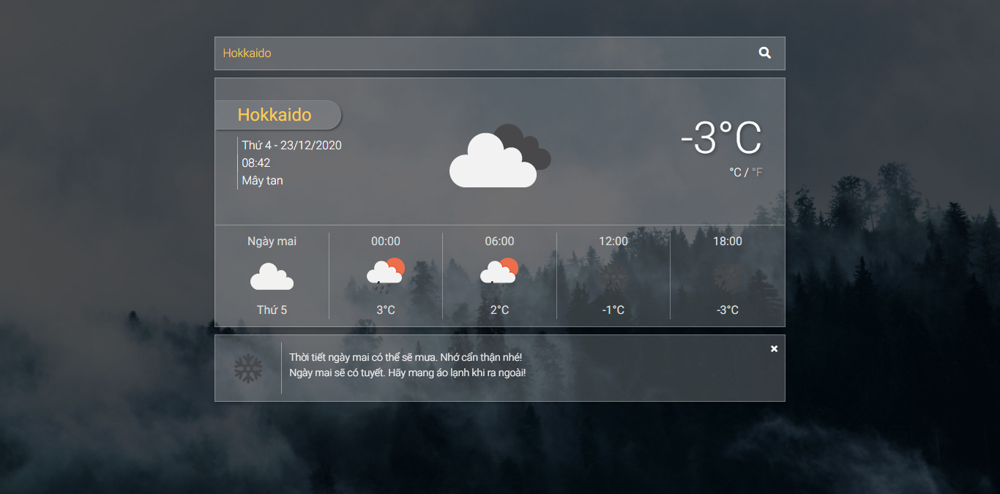

<h3>WEATHER APP</h3>
<a href="http://vinhthien-weather-app.herokuapp.com/" style="background-color: #2C974B; color: #fff;display:inline-block; padding: 2px 5px; margin: 2px;">DEMO WEATHER APP</a>
 <strong>CÁC CÔNG NGHỆ: </strong>
 REACTJS
REDUX
OPENWEATHERMAP API
HTML5
CSS3
JAVASCRIPT
 
